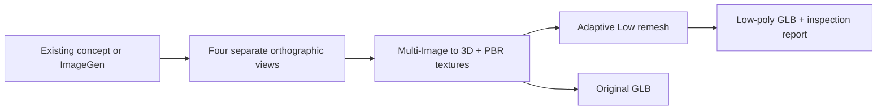

# Meshy Multi-View for Codex

[](https://github.com/KeeVeeG/codex-meshy-multiview/actions/workflows/ci.yml)
[](pyproject.toml)
[](LICENSE)

Turn a concept into four consistent reference views, generate a textured 3D model with Meshy, and create a separate **Adaptive / Low** remesh. Includes a Codex skill, an MCP server, and a resumable command-line workflow.



The image preparation skill works with characters, creatures, props, vehicles, furniture, and other objects. It preserves the source design, selected variant, pose, asymmetry, materials, and camera scale. ImageGen runs through Codex's image-generation tool; this package does not implement a separate image-generation API client.

## What it does

- Accepts exactly four PNG/JPEG files or public HTTPS image URLs: front, back, left, right.
- Uses `meshy-7.1`, textured generation, PBR maps, and all four views as texture references by default.
- Runs remesh as a separate task with `topology: triangle` and `decimation_mode: 4`.
- Saves task IDs, supports resume, and never automatically retries a paid POST.
- Downloads both GLBs, returned texture maps and thumbnails, and inspects triangle counts and embedded base-color texture bindings.
- Provides eight MCP tools and an English skill for the entire concept-to-model workflow.

Adaptive Low is a relative level, **not a fixed polygon budget**. Meshy ignores `target_polycount` when adaptive decimation is enabled. GLB inspection verifies metadata and embedded texture bindings, not artistic quality or reference fidelity.

## Verified example

| ImageGen concept | Meshy Adaptive Low result |
| --- | --- |
|  |  |

A live run through the installed MCP server completed generation, remesh, and downloads: **221,954 → 5,865 triangles**, with embedded base-color textures verified in both GLBs. Meshy reported 35 API credits. The [example](examples/utility-robot/README.md) includes all four references and the reproduction command. Counts and generation quality vary between runs.

## Requirements

- [uv](https://docs.astral.sh/uv/getting-started/installation/) on PATH; Python 3.11+ (uv can provision it).
- A Meshy API key with sufficient API credits.
- Codex with image generation for the optional concept/view preparation step. Existing four-view images also work without ImageGen.

## Install

```sh
git clone https://github.com/KeeVeeG/codex-meshy-multiview.git
cd codex-meshy-multiview
uv sync --locked
uv run codex-meshy-multiview doctor
```

Configure credentials outside the repository. Never paste a real key into a Codex prompt, an issue, a committed file, or a command saved in shell history.

PowerShell, hidden input for the current shell:

```powershell
$meshySecret = Read-Host 'Meshy API key' -AsSecureString
$env:MESHY_API_KEY = [System.Net.NetworkCredential]::new('', $meshySecret).Password
```

Bash:

```bash
read -rsp 'Meshy API key: ' MESHY_API_KEY; echo
export MESHY_API_KEY
```

Alternatively, set `MESHY_API_KEY_FILE` to a private UTF-8 file containing only the key. The environment key takes precedence. `.env.example` documents the names; `.env` files are **not automatically loaded**. The MCP process must inherit one of these variables. See [Codex setup](docs/codex-setup.md) for desktop configuration.

## Use from Codex

Install the runtime and bundled plugin:

```sh
uv tool install .
codex plugin marketplace add .
codex plugin add codex-meshy-multiview@meshy-tools
```

Start a new Codex task after installation. The plugin launches the installed runtime with `uv tool run --offline`, so install the runtime before enabling the plugin. A typical request is:

> Use the Meshy Multi-View skill. Start from my attached concept, preserve its design, create four separate consistent orthographic views, generate a textured model, and remesh it with Adaptive Low. Save both GLBs under my project's outputs directory.

For a new design:

> Create a stylized stone lantern concept with ImageGen, then prepare matching front, left, back and right views and use Meshy to produce a textured model and an Adaptive Low remesh.

The skill includes a reusable, subject-independent [view-generation prompt](plugins/codex-meshy-multiview/skills/meshy-multiview/references/view-generation.md). See [image preparation](docs/image-preparation.md) for consistency checks and handling variant sheets.

## Use from the CLI

Validate four inputs without an API request:

```sh
uv run codex-meshy-multiview plan --front front.png --back back.png --left left.png --right right.png --output ./runs
```

Run generation, remesh, and downloads:

```sh
uv run codex-meshy-multiview run --front front.png --back back.png --left left.png --right right.png --output ./runs
```

Each run has a unique directory. JSON results go to stdout; progress goes to stderr. Use absolute image/output paths when working from Codex. The first view sent to Meshy is always front, followed by right, back, left.

```sh
uv run codex-meshy-multiview resume ./runs/meshy-RUN_ID
uv run codex-meshy-multiview status ./runs/meshy-RUN_ID
uv run codex-meshy-multiview download ./runs/meshy-RUN_ID
```

For short calls suitable for agents, use `start`, then repeated `advance`, then `download`. `advance` polls once and submits remesh when generation succeeds. `status` only reads local state. Waiting has a timeout and remains resumable.

`--texture-prompt "..."` is optional. It replaces four-view texture guidance because Meshy disallows combining `texture_prompt` and `texture_image_urls`. Omit it to preserve the supplied views as the texturing reference.

## Recovery and outputs

The run directory contains `workflow.json`, `generation/model.glb`, `remesh/model.glb`, and any texture/thumbnail files returned by Meshy. State records include signed asset URLs; treat run directories as private. Generated assets, run state, and secrets are ignored by Git.

If a POST times out after it may have reached Meshy, the workflow stops with `submission_uncertain`. Repeating `advance` cannot submit that task again. Identify the correct existing task in your Meshy account (or with `list`), then attach its ID:

```sh
uv run codex-meshy-multiview list --kind multi-image-to-3d --limit 10
uv run codex-meshy-multiview recover ./runs/meshy-RUN_ID --stage generation --task-id EXISTING_TASK_ID
uv run codex-meshy-multiview resume ./runs/meshy-RUN_ID
```

For uncertain remesh, use `--kind remesh` and `--stage remesh`. Recovery checks the ID and endpoint, but cannot prove it corresponds to the same reference images: select the task deliberately. If no task exists, start a new run only after resolving the uncertain submission. A rejected remesh can be diagnosed from saved state; there is no automatic paid retry.

Download promptly: Meshy's [API asset retention](https://docs.meshy.ai/en/api/asset-retention) is limited. Identical downloads are reusable; conflicting local files are not silently overwritten.

## API contract

The implementation uses the [Multi-Image API](https://docs.meshy.ai/en/api/multi-image-to-3d) followed by the [Remesh API](https://docs.meshy.ai/en/api/remesh). Remesh receives the generated GLB URL because the documented `input_task_id` types do not explicitly include Multi-Image tasks. The four-view workflow sends two paid submissions; check [current Meshy pricing](https://docs.meshy.ai/en/api/pricing) before use.

There is no key bundled with this project. Automated tests use mocked responses and synthetic GLBs; they do not spend credits or establish real-world Meshy output quality.

## Development

```sh
uv sync --locked
uv run ruff check .
uv run pytest
uv build
```

CI checks Python 3.11 and 3.12 on Linux and Windows. See [CONTRIBUTING.md](CONTRIBUTING.md), [SECURITY.md](SECURITY.md), and the [MCP tool reference](docs/tools.md).

MIT licensed. Unofficial integration; not affiliated with Meshy or OpenAI.
