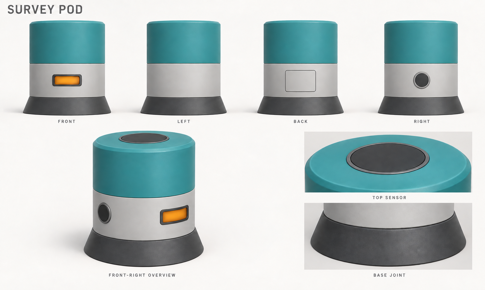
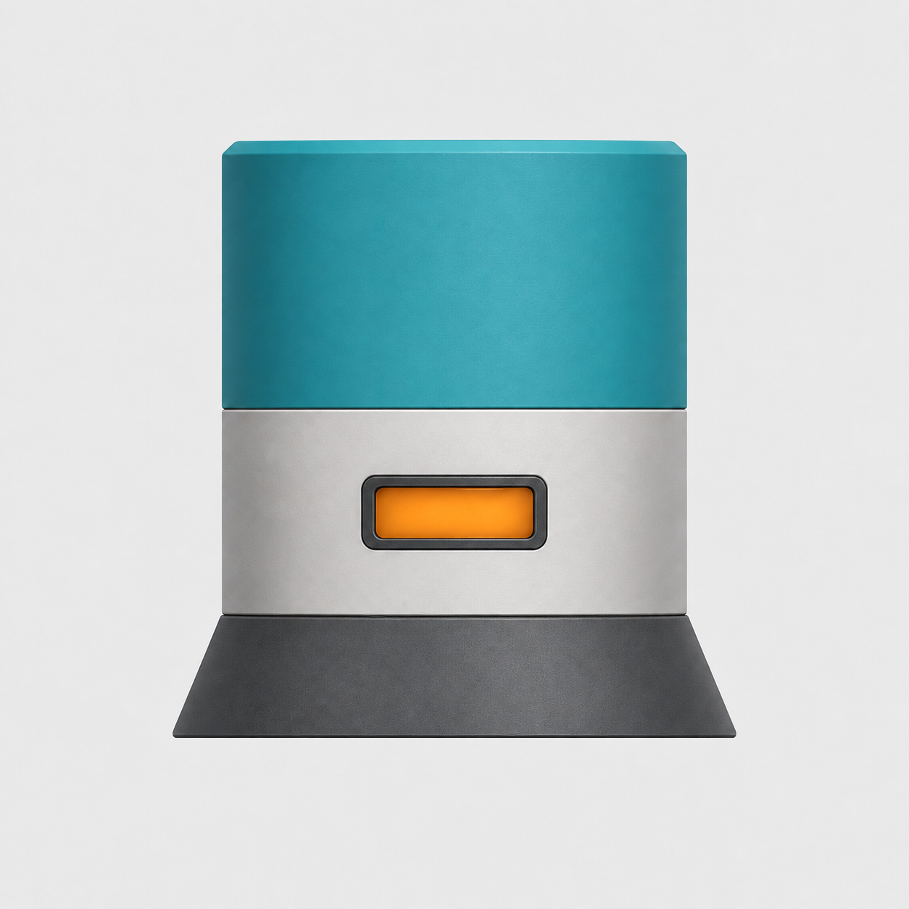
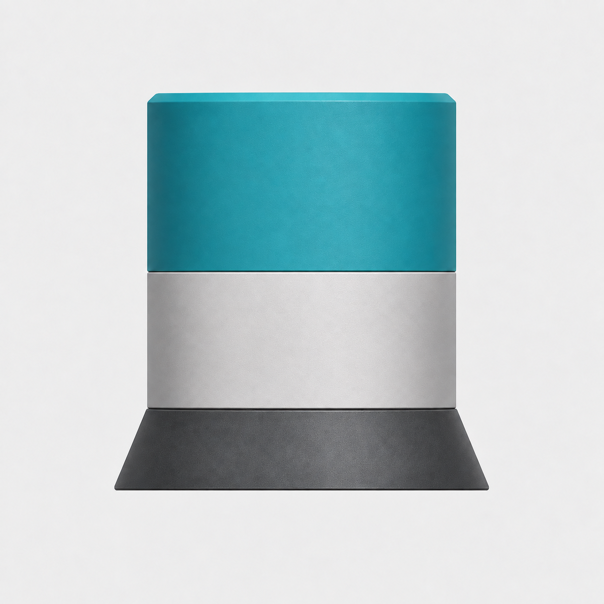
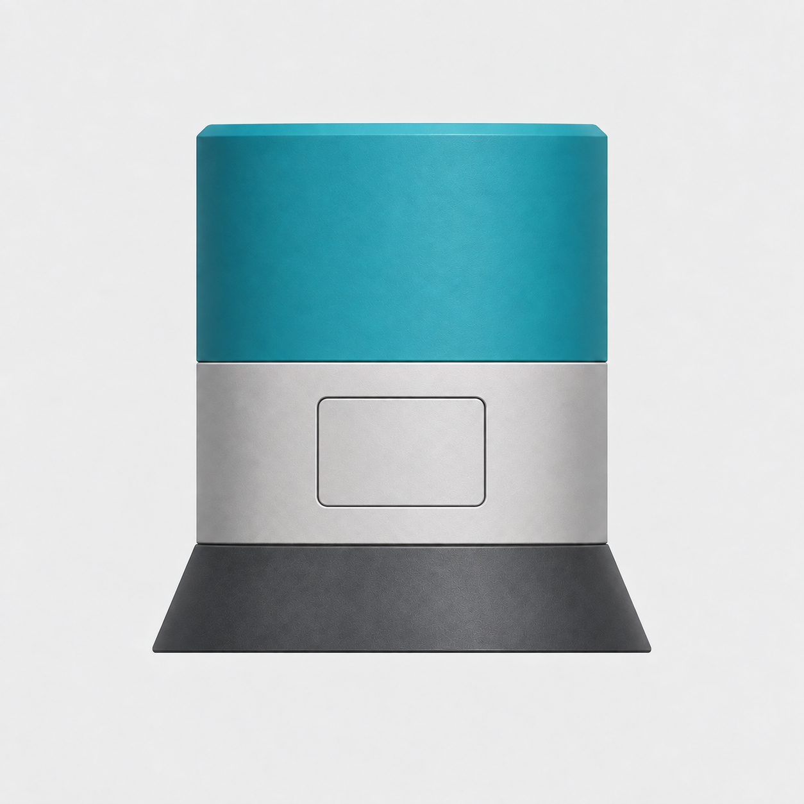
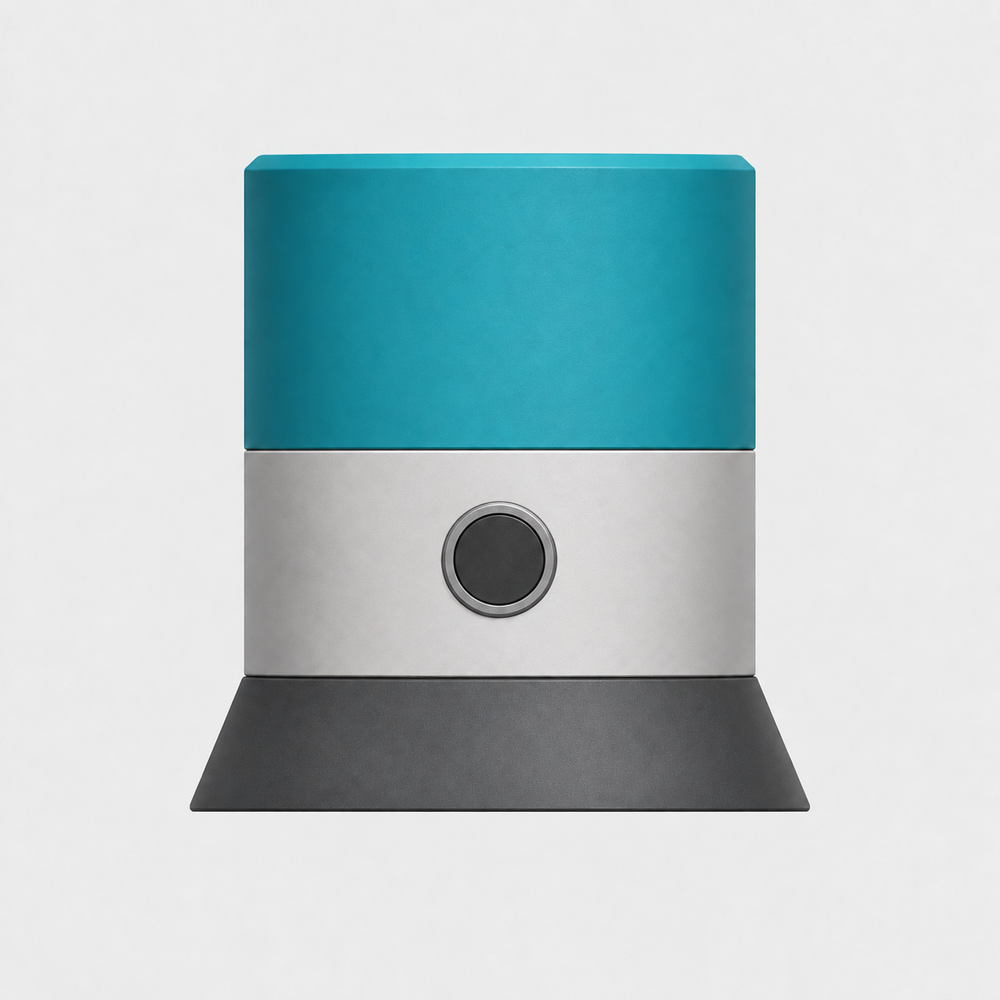
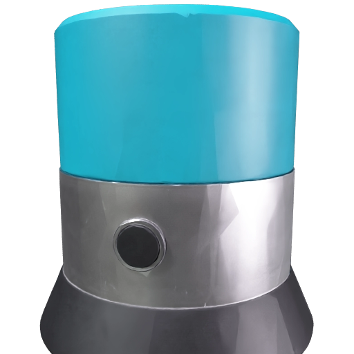

# Survey Pod concept-sheet example

An original scientific game prop designed with ImageGen from a text brief. This example follows the default workflow: concept sheet → four consistent views → textured Meshy model → Adaptive Low remesh.

## Initial concept sheet

The sheet establishes one cylindrical instrument with a teal upper housing, light-gray casing, and flared graphite base. An amber window defines the front, a service cover the back, and a circular connector the subject's right. The subject's left side is blank.



The upper row contains front, left, back, and right elevations. Below are a front-right overview and closeups of the top sensor and base joint. These are views and details of one design, not alternatives or extra parts. Labels belong to the sheet, not the model.

## Four separate Meshy views

| Front | Subject-left |
| --- | --- |
|  |  |
| **Back** | **Subject-right** |
|  |  |

Only these four clean images are submitted to Meshy. The concept sheet is 1620 × 971; each final reference is 1254 × 1254. All are PNGs.

The sheet was visually checked for matching proportions, component counts, connections, material boundaries, and side-specific features. One correction fixed the overview's left/right orientation. The front view then received one correction to remove projection curvature; the remaining views used the accepted sheet and front as references. The final set was checked for common silhouette, scale, alignment, material boundaries, and correct feature placement and occlusion. These are visual consistency checks, not a guarantee of geometric equivalence.

## Resulting model



Meshy's returned preview shows the connector side of the remeshed model. The cylindrical body, three material regions, and connector remain recognizable; remeshing introduces visible faceting. The flush top sensor shown on the sheet is hidden from all four level input views, so this input set does not establish that detail for reconstruction.

## Reproduce the workflow

From the repository root, with your own Meshy credentials configured:

```sh
uv run codex-meshy-multiview run --front examples/survey-pod/front.png --back examples/survey-pod/back.png --left examples/survey-pod/left.png --right examples/survey-pod/right.png --output ./runs
```

This submits one paid generation and one paid remesh. Models and private task state are saved under `runs/`, outside version control. Counts and generation quality vary between runs.

## Recorded live validation

Verified on 2026-09-20 through the installed stdio MCP server: doctor → plan → start → advance → download.

| Check | Original | Adaptive Low remesh |
| --- | --- | --- |
| Meshy status | SUCCEEDED | SUCCEEDED |
| Stored mesh triangles | 352,496 | 6,249 |
| Embedded base-color texture | Verified | Verified |
| Materials | 1 | 1 |
| Embedded images | 3 | 2 |
| GLB size | 16,251,716 bytes | 12,655,004 bytes |
| Reported API credits | 30 | 5 |

Both downloaded previews were visually inspected. GLB inspection returned no warnings. This verifies API completion, mesh reduction, and embedded texture bindings; it does not establish exact reconstruction of every design detail. Models remain local; credentials, task IDs, and signed asset URLs are not included in this example.
