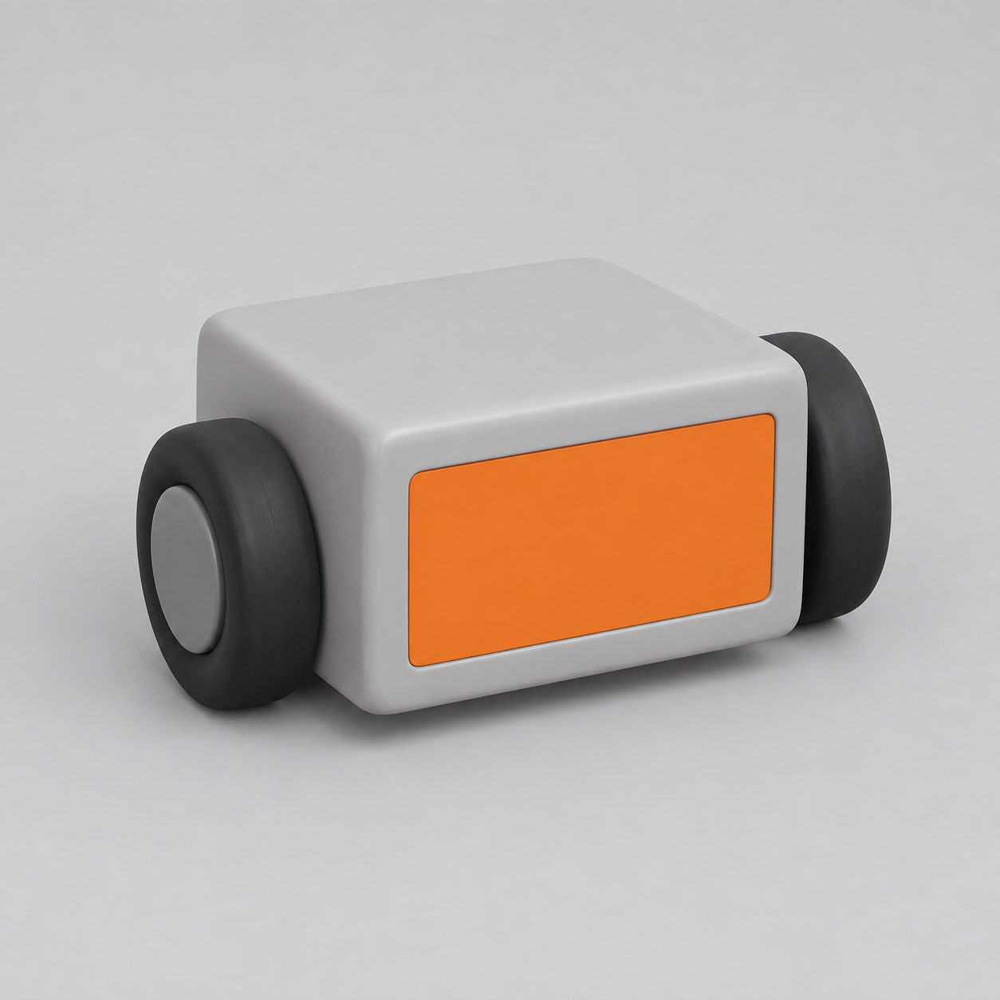
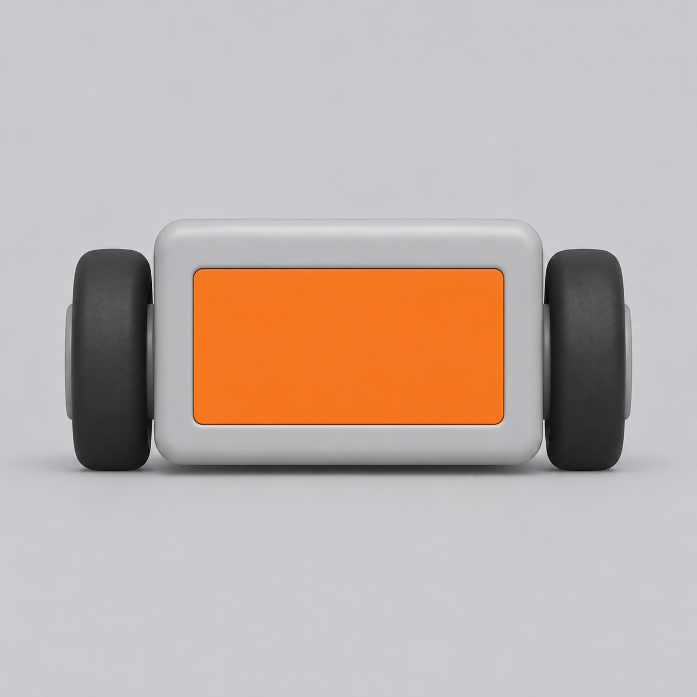
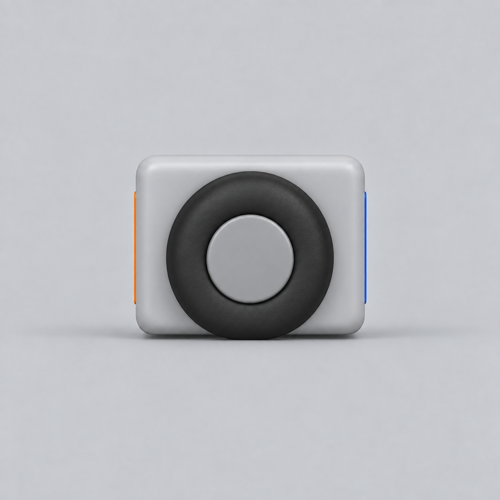
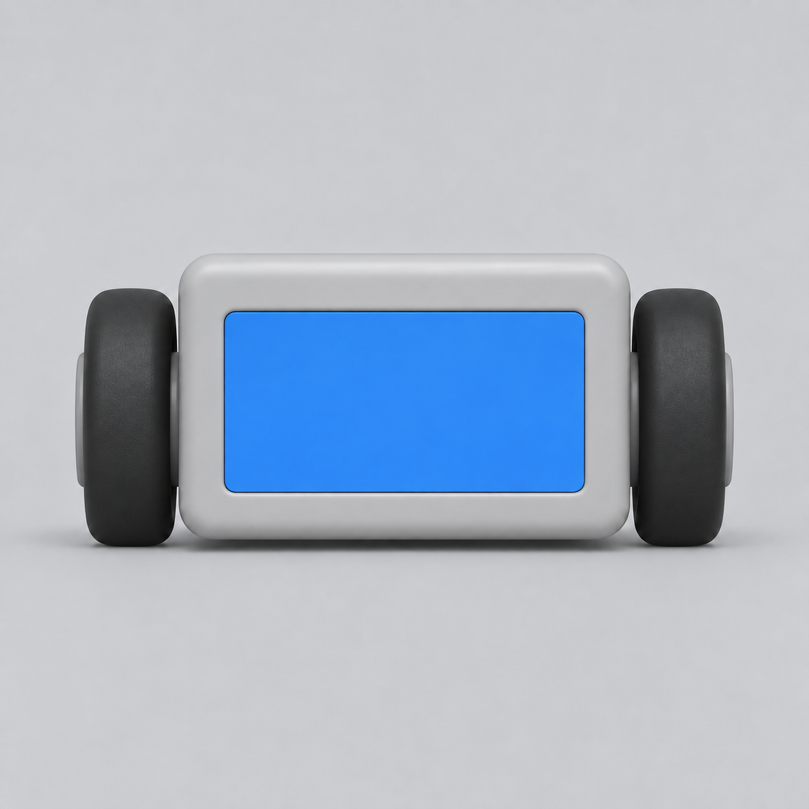
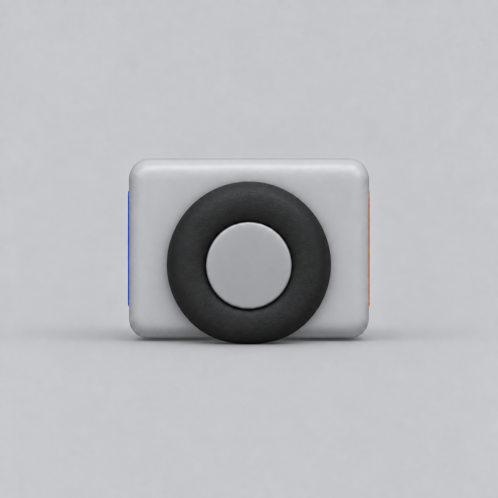
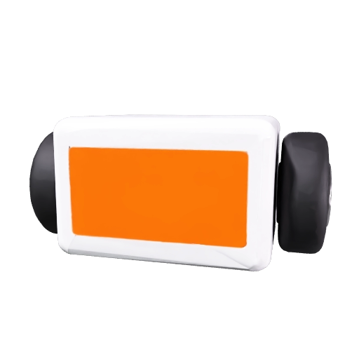

# Utility robot example

A synthetic concept and four orthographic reference views generated with ImageGen for this integration. The orange panel defines the front; the blue panel defines the back. Left and right refer to the robot's own sides.

All reference PNGs are 1254 × 1254. Two targeted corrections per side reduced scale and wheel-position differences; small residual differences remain. These are generated references for an API smoke test, not dimensionally exact engineering drawings.

## Initial concept

This example starts from a single concept image. New ImageGen references default to a concept/reference sheet; an existing or explicitly requested single image remains a supported starting point.



## Four separate Meshy views

| Front | Subject-left |
| --- | --- |
|  |  |
| **Back** | **Subject-right** |
|  |  |

## Resulting model



## Reproduce the workflow

From the repository root, with your own Meshy credentials configured:

```sh
uv run codex-meshy-multiview run --front examples/utility-robot/front.png --back examples/utility-robot/back.png --left examples/utility-robot/left.png --right examples/utility-robot/right.png --output ./runs
```

This command submits one paid generation and one paid remesh. Generated models and private task state are saved under `runs/`, outside version control.

## Recorded live validation

Verified on 2026-09-20 through the installed stdio MCP server using the public tool interface: doctor → plan → start → advance → download.

| Check | Original | Adaptive Low remesh |
| --- | --- | --- |
| Meshy status | SUCCEEDED | SUCCEEDED |
| Stored mesh triangles | 221,954 | 5,865 |
| Embedded base-color texture | Verified | Verified |
| Materials | 1 | 1 |
| Embedded images | 3 | 2 |
| GLB size | 11,719,956 bytes | 10,859,204 bytes |
| Reported API credits | 30 | 5 |

Both downloaded previews were visually inspected. The result demonstrates the API integration and texture retention; it is not a guarantee of topology or artistic quality for arbitrary subjects. The GLBs remain local rather than being bundled in the repository. No credentials, task IDs, or signed asset URLs are included here.
